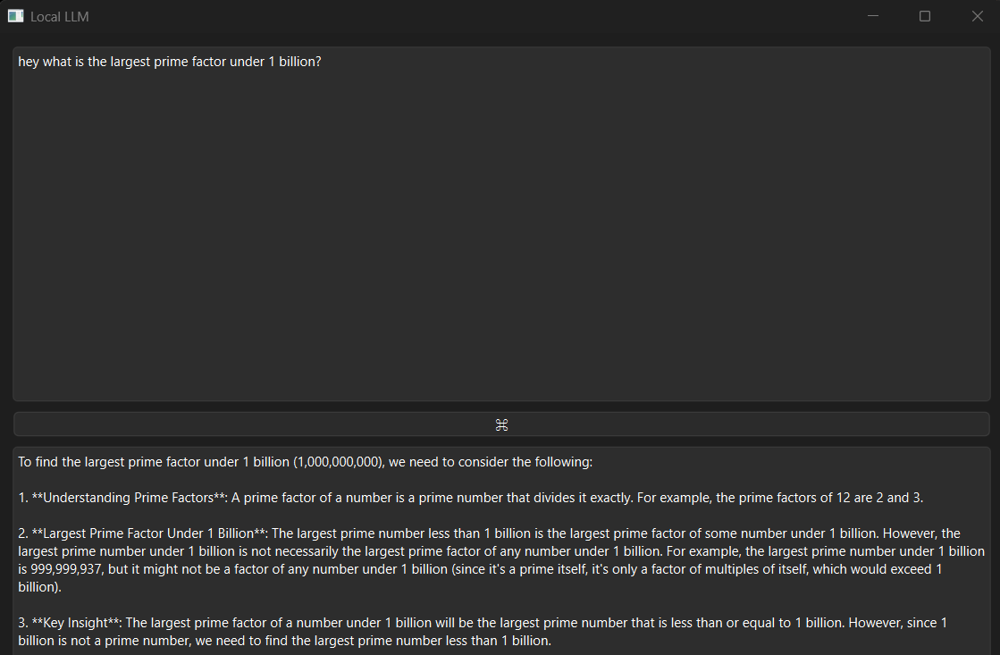

# Local LLM 


## Native C++ LocalLLM with zero phoning home.
- No phoning home is the main goal. LLM with retrieval augmentation and a local database with zero outside communication.
### Roadmap and priorities:
  - CUDA
  - Local database with retrieval augmentation.
  - Attempt to utilize Qt Networking and Network Authorization components to ensure the application is inaccessible via internet and bluetooth.
  - using See `LocalLLM.vcxproj`

#### Setup and configuration until I setup automatic releases with GitHub actions:**
**VS 2026 Configuration**
*Note: Powershell 7 and 'Arguments' is customized. Play close attention to the enforcenment of x64*
```
- VS 2026 Developer PowerShell
 - Name: 	PWSH7 x74
 - Location:	C:\Program Files\PowerShell\7\pwsh.exe
 - Arguments:	-NoExit -Command "& { Import-Module """$env:VSAPPIDDIR\..\Tools\Microsoft.VisualStudio.DevShell.dll"""; Enter-VsDevShell -SkipAutomaticLocation -SetDefaultWindowTitle -DevCmdArguments '-arch=x64 -host_arch=x64' -InstallPath $env:VSAPPIDDIR\..\..\}"
```
```
<ItemDefinitionGroup Condition="'$(Configuration)|$(Platform)'=='Release|x64'">
  <ClCompile>
    <WarningLevel>Level3</WarningLevel>
    <FunctionLevelLinking>true</FunctionLevelLinking>
    <IntrinsicFunctions>true</IntrinsicFunctions>
    <SDLCheck>true</SDLCheck>
    <PreprocessorDefinitions>NDEBUG;_WINDOWS;%(PreprocessorDefinitions)</PreprocessorDefinitions>
    <ConformanceMode>true</ConformanceMode>
    <LanguageStandard>stdcpp20</LanguageStandard>
    <MultiProcessorCompilation>true</MultiProcessorCompilation>
    <LanguageStandard_C>stdc17</LanguageStandard_C>
    <AdditionalIncludeDirectories>$(SolutionDir)llama.cpp\include;$(SolutionDir)llama.cpp\ggml\include;%(AdditionalIncludeDirectories)</AdditionalIncludeDirectories>
  </ClCompile>
  <Link>
    <SubSystem>Windows</SubSystem>
    <GenerateDebugInformation>true</GenerateDebugInformation>
    <AdditionalLibraryDirectories>$(SolutionDir)llama.cpp\build\src;$(SolutionDir)llama.cpp\build\ggml\src;%(AdditionalLibraryDirectories)</AdditionalLibraryDirectories>
    <AdditionalDependencies>llama.lib;ggml.lib;ggml-base.lib;ggml-cpu.lib;%(AdditionalDependencies)</AdditionalDependencies>
  </Link>
</ItemDefinitionGroup>
---

```
- Building with Visual Studio
```
Build started at 1:17 AM...
1>------ Build started: Project: LocalLLM, Configuration: Release x64 ------
1>   Qt/MSBuild: 3.4.1.0
1>  Reading Qt configuration (C:/Qt/6.10.1/msvc2022_64/bin/qmake)
1>   Qt: 6.10.1
1>  LocalLLM.cpp
1>  Generating code
1>  Previous IPDB not found, fall back to full compilation.
1>  All 172 functions were compiled because no usable IPDB/IOBJ from previous compilation was found.
1>  Finished generating code
1>  LocalLLM.vcxproj -> C:\...\LocalLLM\x64\Release\LocalLLM.exe
1>  'pwsh.exe' is not recognized as an internal or external command,
1>  operable program or batch file.
========== Build: 1 succeeded, 0 failed, 0 up-to-date, 0 skipped ==========
========== Build completed at 1:17 AM and took 01.635 seconds ==========
```
- The community/open-source version of Qt is included, see (`LocalLLM.vcxproj`)
```
<QtInstall>msvc2022_64</QtInstall>
<QtPathBinaries>C:\Qt\6.10.1\msvc2022_64\bin</QtPathBinaries>
<QtPathLibraryExecutables>C:\Qt\6.10.1\msvc2022_64\modules</QtPathLibraryExecutables>
```
---
## Notes
---
- In Developer Powershell (x64) run `cl`
```
Microsoft (R) C/C++ Optimizing Compiler Version 19.50.35723 for x64  # Ensure x64
Copyright (C) Microsoft Corporation.  All rights reserved.
usage: cl [ option... ] filename... [ /link linkoption... ]
```
- `$env:VCToolsVersion = "14.44.35207"`
- Then,
```
git -clone https://github.com/ggml-org/llama.cpp
```
- Once completed, move the completed `llama.cpp` directory into the same directory of this repository as a subdirectory.
- e.g.: `C:/../repos/LocalLLM/llama.cpp`
```
cd .\llama.cpp
```
```
PS C:\...\LocalLLM\llama.cpp> $env:VCToolsVersion = "14.44.35207"

PS C:\...\LocalLLM\llama.cpp> cl
Microsoft (R) C/C++ Optimizing Compiler Version 19.50.35723 for x64
Copyright (C) Microsoft Corporation.  All rights reserved.

usage: cl [ option... ] filename... [ /link linkoption... ]

PS C:\...\LocalLLM\llama.cpp> nvcc --version
nvcc: NVIDIA (R) Cuda compiler driver
Copyright (c) 2005-2025 NVIDIA Corporation
Built on Tue_Dec_16_19:27:18_Pacific_Standard_Time_2025
Cuda compilation tools, release 13.1, V13.1.115
Build cuda_13.1.r13.1/compiler.37061995_0
```
- Build with `Ninja` via x64 (e.g.: MVSC 2022 with `$env:VCToolsVersion = "14.44.35207"`)
- If you don't have `Ninja`, install it. Something like `winget install -e --id Ninja-build.Ninja`
- This ensures you're able to build with CUDA locally. A lot of suppressions are added to try to find errors instead of a hundred thousand warnings.
- My modifications to `.\LocalLLM\llama.cpp\ggml\src\ggml-cuda\CMakeLists.txt` was to ensure that building for my specific RTX 5090 works as opposed to wasting time building for everything.
- If you're using RTX 5090 then you my want the same modification.

```
$CUDA129 = "C:\Program Files\NVIDIA GPU Computing Toolkit\CUDA\v12.9"
```
```
cmake -S . -B build-cuda -G Ninja `
  -DCMAKE_BUILD_TYPE=Release `
  -DBUILD_SHARED_LIBS=ON `
  -DGGML_BACKEND_DL=ON `
  -DGGML_CUDA=ON `
  -DGGML_NATIVE=OFF `
  -DGGML_CPU_ALL_VARIANTS=OFF `
  -DCUDAToolkit_ROOT="$CUDA129" `
  -DCMAKE_CUDA_COMPILER="$CUDA129\bin\nvcc.exe" `
  -DCMAKE_CUDA_ARCHITECTURES=120 `
  -DCMAKE_CUDA_FLAGS="--use-local-env -allow-unsupported-compiler"
```
Then:
```
 cmake --build build-cuda
 ```